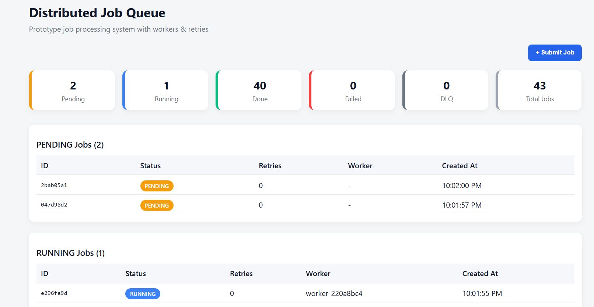
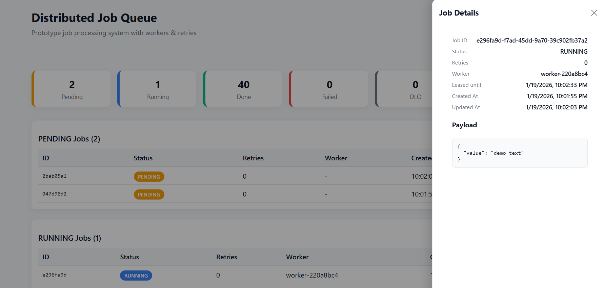
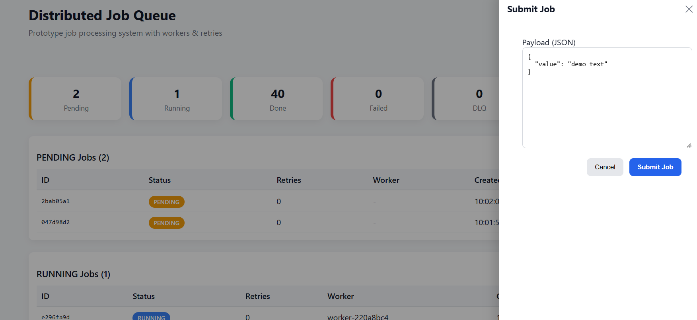

# Distributed Job Queue & Worker System (Prototype)

This project is a small-scale distributed job queue system built as a prototype to demonstrate:
- Durable job submission
- Worker-based processing with retries
- Lease + ack semantics
- Per-user quotas & rate limits
- Real-time job visibility via a dashboard

## High Level Architecture

```
┌────────────┐     REST API     ┌──────────────┐
│   React    │ ─────────────▶ │   Express     │
│ Dashboard  │ ◀───────────── │   API Server  │
└────────────┘                  └──────┬───────┘
                                       │
                                       ▼
                                 ┌──────────┐
                                 │  SQLite  │
                                 │ Job Store│
                                 └────┬─────┘
                                      │
                           Poll + Lease + Ack
                                      │
                                      ▼
                                 ┌──────────┐
                                 │  Worker  │
                                 │  Process │
                                 └──────────┘
```

## Core Concept

### Job Life Cycle

```
PENDING → RUNNING → DONE
               ↘
                FAILED → retry → PENDING
                          ↓
                        DLQ
```

- Lease: Worker claims a job for a fixed duration
- Ack: Successful completion marks job as DONE
- Retry: Failed jobs are retried up to max_retries
- DLQ: Jobs exceeding retries are moved to Dead Letter Queue

## Dashboard Features

- Live job status updates (polling)
- Submit jobs with custom JSON payloads
- Click a job to inspect full details


<hr>

<hr>

<hr>

### Authentication (Prototype level)

- Simple API key-based auth
- Each request must include:

```
Authorization: Bearer user-1-key
```

### Observability

Every major event is logged:
- Job submitted
- Job started
- Job completed
- Job failed / retried

All logs include `job_id` for traceability.

## Design Trade-Offs

### SQLite

Pros : 
- Zero setup, file-backed durability
- Easy local development

Cons : 
- Limited write concurrency
- Not suitable for high-throughput production workloads

### Polling

Pros : 
- Polling Keeps architecture simple

Cons : 
- Adds Latency and extra queries

Websockets are preferable for production

### Authentication

- API key auth chosen for simplicity
- OAuth / JWT intentionally avoided for prototype speed

## Auto-Scaling Workers

We should consider Scaling-up if : 
- High number of PENDING jobs
- Long job wait times
- High retry pressure

We should consider scaling down if :
- Empty queue
- Sustained low CPU usage
- Low pending jobs

We can go for following implementation options : 
- Implement Kafka based distributed architecture for worker processing
- Kubernetes HPA based on metrics
- Integrating Cloud Queue Service ( SQS / PubSub)

## How to run locally

### 1. Backend ( Express + SQLite )

```
cd server
npm install
node index.js
```

Server runs on: `http://localhost:4000`

### 2. Frontend ( React )

```
cd client
npm install
npm start
```

Dashboard runs on: `http://localhost:3000`